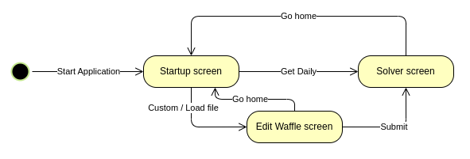

# System requirements

Requirements are derived from the application flow

Modelled in [application prototype](https://www.figma.com/proto/IFupHdMiKBGwpyWTNasSc0/Waffle-Cooker?type=design&node-id=1-3&t=SekCsurbLaWEVJ7G-1&scaling=min-zoom&page-id=0%3A1&starting-point-node-id=1%3A3)

Exceptions are mapped [here](../exceptions/README.md).

| Requirement ID  | Description                               | Met ? |
|-----------------|-------------------------------------------|-------|

Test cases provided accordingly

### Other

Functional requirements

- Define system and what its components do
- Behaviour and functionality of system, and its tasks and outcomes
- Typically specified by users / stakeholders and basis for functional testing

Non-functional requirements

- Define the quality attributes of a system
    - Performance, usability, security and reliability
- Typically specified by technical people, such as architects, software devs

E.g. given a banking application,

- Functional requirement - "The system must allow users to transfer funds between their accounts"
    - Species a specific action (transferring funds) that system must support
- Non-functional requirement - "The system must support up to 1000 concurrent users without performance degradation"
    - Ensures that performance of system can handle large # of users simultaneously without significant drop in performance

